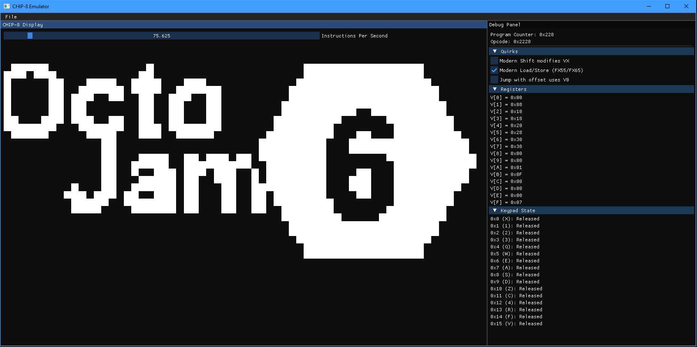

# CHIP-8 Emulation Project
## Description
This project began as a suggestion from a [colleague](https://github.com/MoltenMoustache/CHIP-8/tree/master) and evolved into a CHIP-8 emulator built entirely from scratch, using this [guide](https://tobiasvl.github.io/blog/write-a-chip-8-emulator/) as the primary reference. It was a straightforward idea that, predictably, became less straightforward over time.



## Installation
1. Ensure you have a recent version of CMake installed — ideally one from this decade.
2. From the root of the project directory, run the following command to generate the Visual Studio project files:
```
cmake -G "Visual Studio 17 2022" -B .
```
3. Assuming nothing caught fire, you should be ready to build.

## History
CHIP-8 was developed in 1977 by RCA engineer Joe Weisbecker for the COSMAC VIP — a microcomputer from an era when 2KB of RAM was considered plenty.
The CHIP-8 interpreter allowed users to write programs in a simplified, pseudo-machine code format using hexadecimal input.
It was designed to make programming more accessible. In 1977, that meant typing opcodes by hand and hoping for the best.

## Project Aspirations
- Add Audio support.
- Add font management.
- Add support for Super Chip & XO Chip roms.
- Expand & refine ImGui layout.
